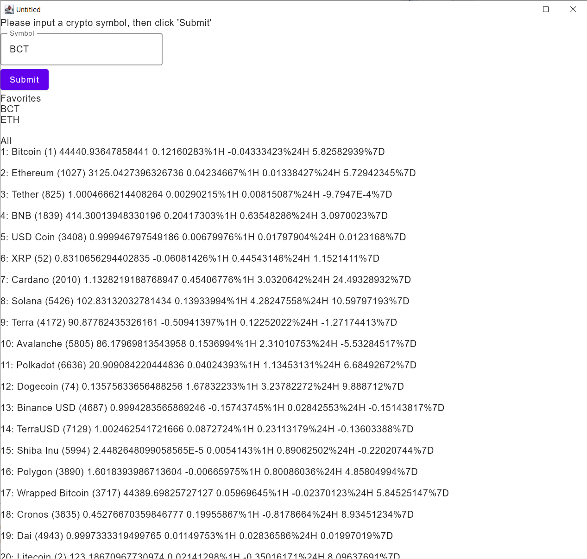

# Cryptocurrency tracker made with Kotlin and Compose for Desktop
(work-in-progress)

## Usage
1. Open this project in IntelliJ. Make sure that you have the JetBrains plugin 'Compose Multiplatform IDE Support'
2. Run Main.kt. Ensure that it loads dummy data
3. Create file 'src/main/resources/local.properties' (copy from local.properties.template) and add your [CoinMarketCap API](https://coinmarketcap.com/api) key there
4. In CoinMarketCapApi.kt, change `IS_TEST` to false
5. Run the app again to see real data for the top 100 cryptocurrencies on CMC

## Screenshots

## TODO
- Clean up UI
- More features
